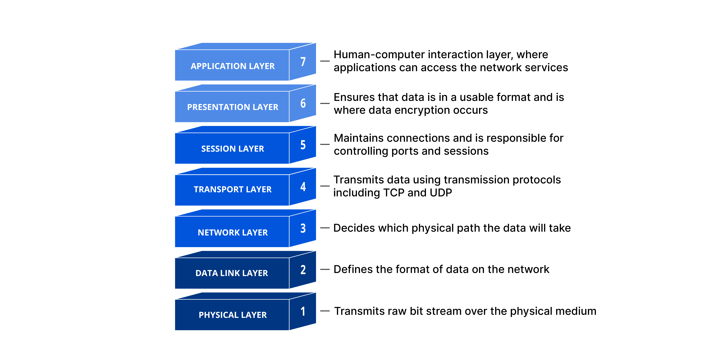

# IP, DNS, HTTP e mais

Anteriormente falamos sobre como a internet funciona de modo superficial e um pouco de sua história. Aqui vou expor alguns conceitos fundamentais sobre redes e como a internet funciona por baixo do capô.

## Internet Adresses

Cada computador/dispositivo que se conecta à internet é indentificado. Isso é feito através de um código chamado de _IP address_. A tecnologia mais comum para atribuir ip adresses é o _IPV4_. Nesse esquema o codigo do computador tem o formato "nnn.nnn.nnn.nnn" onde cada 'n' pode ser um número entre 0 e 255. Essa metodologia só suporta um número especifico de computadores: 2^32 (4294967296 para ser mais preciso). Contudo, exitem cerca 1,8 bilhões de dispositivos ativos e conectados a internet. Por isso uma nova metodologia chamada _IPV6_ está sendo implementada.

## OSI, Protocols & Packets

Fazendo uma pesquisa rápida no google:

> Protocolo é um conjunto de informações, de decisões, de normas e de regras definidas a partir de um ato oficial.

Para que você, do computador A (endereço IP 1.2.3.4), consiga se comunicar com o computador B (endereço IP 5.6.7.8), você precisa seguir um conjunto de procedimentos que vão desde formatar os dados da maneira correta até efetivamente envia-los.

De uma forma mais simples do que correta, os dados que existem no seu computador vão ser transformados em "Ondas" ([ondas eletromagnéticas](https://www.google.com/search?q=ondas+eletromagneticas)) que então vão "andar" pelo seu fio de internet e chegar até o computador de destino.

Uma representação de como isso funciona é feita através do modelo OSI:

- **Application**, **Presentation** e **Session** layers fazem várias coisas mas o que realmente importa aqui é entender que: são nessas 3 "camadas" que vamos decidir _Como_ enviar apartir _do que_ vamos enviar.
  Exemplo: Se queremos enviar ou receber sites nós vamos usar o protocolo HTTP, logo a application, presentation e session layers vão fazer maracutaias para isso funcionar. Se, por outro lado, quisessemos enviar um email (pelo gmail, outlook, etc) então nós teriamos que seguir as regras do SMTP (Simple Mail Transfer Protocol). Resumindo, é aqui que nós defimos qual protocolo será usado na comunicação e descobrimos quais regras teremos que seguir.

- **Transport layer** chamada também de TCP, é como se fosse um guarda de transito, o trabalho dele é garantir que todas as informações transmitidas cheguem sem falha até o seu destino. Uma observação importante é que os dados que são transportados pela internet precisam ser pequenos, isso devido a limitações físicas que os fios tem. Dessa forma, quando você envia um arquivo grande, ele é "quebrado" em pequenas partes chamadas de **Packets**. É trabalho da Transport layer garantir que todos os pedaços cheguem inteiros até seu destino, uma vez que nem todos os packets seguem pelo mesmo caminho, mas todos tem o mesmo destino.

- **Network Layer** aqui é onde ficam informações sobre o "para quem" iremos enviar os dados. Existem varias tecnologias que são usadas aqui porém a mais comum é o **IP** (internet protocol). O trabalho do IP é rotear os dados para o local correto. Enquanto o trabalho do TCP é garantir que os dados cheguem "Inteiros", o trabalho do IP é garantir que os dados cheguem no lugar certo.

- **Data link layer** é ignorável nessa introdução (não é nada pessoal...)

- **Physical layer** é aqui que os dados são transmitidos ou recebidos. Se você está enviando os dados, você vai transformar "bits" virtuais em "Pulsos de energia" (ondas) e então mandar eles dentro de fios. Um pouco acima eu falei que os fios não aguetam muitos dados, é justamente por causa dessa conversão. Se o fio tivesse que aguentar packets muito grandes eles teriam que ser mais grossos, ter mais corrente elétrica, etc. Fios desse tipo são usados em data centers e empresas, não em domicílios.

No final das contas, todo packet que você envia precisa ter um header (conjunto de informações adicionais) TCP (vai catalogar todas os packets formados), um header IP (vai dizer o endereço final correto), um header MAC e o "pedaço" de dado que ele vai enviar:

## HTTP: Como funciona e exemplo

HTTP é protocolo que fica na "application layer" que falamos anteriormente. O grande diferencial do HTTP é o fato dele funcionar através de request/responses e ser stateless. Vamos entender isso com um exemplo:

Quero acessar o youtube pelo computador, o que faço?

0. ligo o computador e faço todos outros passos irrelevantes para essa explicação
1. abro um navegador (chrome, firefox, opera, edge, etc)
2. digito "youtube.com" na barra de pesquisa
   - _youtube.com_ é nome do site, mas os computadores não leem letras, mas sim números. Assim, para que o computador entenda ele vai "converter" o nome do site para o IP do site através de um **DNS server**.
3. O navegador abre o youtube
   - criamos um "pedido" e enviamos ele através do protocolo HTTP (seguindo as camadas 7 até 1 da imagem lá de cima).
   - O server(computador parrudo) do google (empresa dona do youtube) recebeu meu pedido, disso que estava tudo ok e me mandou uma resposta OK, juntamente com o conteudo do youtube, através do HTTP, usando HTML
   - O navegador recebeu o HTML (e outros dados), interpretou eles, e "desenhou" o resultado final na tela.

Mas o que "stateless" quer dizer então? Quer dizer que nem o cliente (quem fez o pedido, ou seja, navegador/você), nem o server (quem recebe o pedido, ou seja, computador do google), pode ou consegue guardar informações sobre essa "comunicação" que aconteceu.

Você pode pensar nisso como se fosse um panfleteiro. Eles não lembram da cara das pessoas que passam na rua, eles simplismente entregam o planfleto para elas. Para testar, é só você ficar passando na frente de um panfleteiro em um lugar movimentando. Se ele não perceber você, vai continuar entegrando panfletos.

## Referências e recomendações

- [How Does the Internet Work?](http://www.theshulers.com/whitepapers/internet_whitepaper/index.html#int_infra)
- [MDN webDocs sobre HTTP](https://deveesdrúxulosloper.mozilla.org/en-US/docs/Web/HTTP/Overview)
- [NETWORK ENCYCLOPEDIA](https://networkencyclopedia.com/network-packet/)
- [Cloudfare](https://www.cloudflare.com/pt-br/learning/ddos/glossary/open-systems-interconnection-model-osi/)
