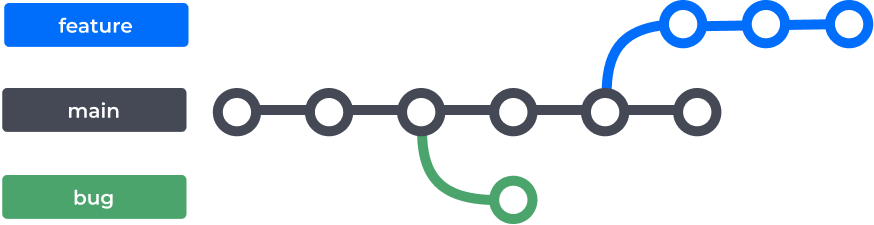
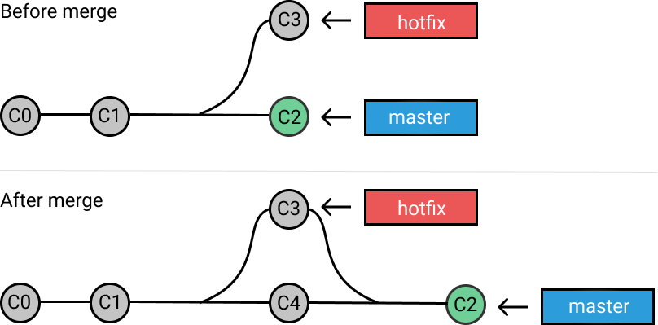

# Git

Git é um sistema distribuido de controle de versão. Pense nele como um google drive ou microsoft one drive contudo que é voltado para arquivos de texto. Com ele você consegue verificar todas as alterações que você (ou outra pessoa) fizeram nos arquivos e, se necessário, voltar para a ultima versão salva.

## Basic shell comands

A principal forma de usar git é através da linha de comando, chamada de CLI, shell, Bash, entre outros nomes. É a famosa tela preta com letras pequenas atrelada à hackers.
No final das contas a CLI é uma forma de contato direto do usuário com o sistema operacional - pense nela como uma forma completa/profunda de controlar o computador.
Antes de entender como o git é usado devemos conhecer os principais comandos usado CLI:

- mkdir: cria uma pasta (chamado também de diretório) num local que vc especificar. Ex: `mkir ./pasta1`.
- ls: lista todas os arquivos e diretórios não ocultos no diretório atual (por padrão). Ex: `ls `;
- cd: muda o diretório/pasta em que você está. Ex: `cd ../`. O './' simboliza o diretorio atual, '../' o direito anterior.
- man: serve para pesquisar a funcionalidade de um comando. Ex: `man cd`
- nano: abre o editor de arquivos "nano", é como se você o notepad++ ou editor de texto da microsoft, só que dentro da CLI.
- clear: limpa as linhas do terminal, deixando a tela mais limpa.
- echo: Usando para escrever/mostrar algo no terminal. Ex: `echo texto`
- cat: Usado para ler o conteúdo de um arquivo e escrever/mostra-lo no terminal.
- pwd: vai dizer qual o absolute path do diretório em que você está.
- rm: usado para deletar arquivos e pastas.

## Git under the hood

Para criar um repositório que possue as funcionaliades do git, você tem que ir até pasta que você quer versionar, abrir o terminal naquela pasta/diretório e então, no terminal, escrever `git init`.
Normalmente você usa git init na _root folder_, do seu projeto (pasta que contém/engloba todas as outras pastas e arquivos de seu projeto).
Esse comando vai criar uma pasta oculta chamada de .git (arquivos cujo nome começam com um ponto são ocultos). Para vê-lo você pode usar `ls -la` ou ir no windows explorer e habilitar a visualização de arquivos ocultos. Se o comando funcionar a palavra "master" ou "main" será exposta no terminal.

De maneira resumida, quando você cria um arquivo ou uma pasta com arquivos, o git vai analisar o conteúdo e criar uma Object para representar esses arquivos dentro do **git file system**.
Dessa forma, se você apagar os arquivos originais, os objetos, que foram criados pelo git, vão continuar lá.
É como se o git tivesse uma database separada do seu projeto, de modo que, se você criar um objeto (através de comandos que veremos mais a frente) e depois apaga o arquivo original, o objeto continuará lá.

> Existem 4 tipos de objetos no git: `blob`, `tree`, `commit` e `tag`.

Todos os objetos em git tem 4 características:

- conteúdo. Ex: "Oi"
- tipo. Ex: blob
- tamanho. Ex: 11 bytes
- delimiter (simbolo que diz para o computador onde o arquivo termina). Ex: \0(padrão)

Quando você cria uma arquivo, o git não faz nada, basicamente. É necessário criar um objeto apartir de seu conteúdo através de comandos. Esse objeto é normalmente do tipo "blob". Esse blob, assim como todos os outros objetos precisam de nomes. Os nomes desses objetos são criados usando uma _hash function_, que é o processo de pegar o conteúdo do arquivo e criptografa-lo. Os objetos criados pelo git ficam dentro da pasta ".git", na pasta objects.

**OBS**: Vamos usar low-level comands para criar git objects. Isso significa que estamos fazendo manualmente o que os comandos famosos `git add` e `git commit` fazem.

### Low-level comands:

- git hash-object
- git cat-file
- git mktree

## Blob objects

Vejamos como criar um objeto do tipo blob como o seguinte comando:

```bash
echo "oi" | git hash-object --stdin -w
```

`echo "oi"` vai escrever "oi" na tela. O símbolo `|` é chamado de _pipe_ e vai ser usado para concatenação, nesse caso sendo usado para redirecionamento, ou seja, vai pegar a saida de um comando e passar como entrada de outro comando.
O comando `git hash-object` é um comando do git que aplica um hash function em alguma coisa. Como `pipe` fora usado ele vai aplicar a hash function à palavra "oi".
O restante do comando,`--stdin -w`, é/são as _opções do comando_. Opções do comando servem para fazer coisas específicas com um comando.
Normamente opções de comando vem depois do comando principal e são precedidas de um tracinho ("-").
No final das contas esse comando vai escrever na tela um código chamado de hash e vai criar um objeto dentro da pasta .git/objects. Ou seja, ao usar esse comando você criou um objeto que tem como conteúdo o texto "oi" e cujo nome é igual ao hash.
Se você for na pasta .git/objects você verá uma pasta com nome igual a dois caracteres e dentro dela um arquivo com um código. Se você juntar os caracteres da pasta com o código que é o nome do arquivo você descubrirá qual é o hash do objeto.

Hash functions são usadas para criptografar (esconder) arquivos. Existem diversos tipos de criptografia, contudo o git usa a função hash SHA-1.
Como ja dito, o Hash é criado de acordo com o conteúdo dado ao comando. Outros detalhes sobre hashing com o git são:

1. tendo o hash você não consegue achar o conteúdo, ou seja, você não consegue descriptografar (chamado de _one way function_).
2. Indenpendentemente do tamanho do conteúdo/arquivo que você usar na hash function, o resultado, ou seja, o Hash, sempre terá o mesmo número de caracteres. Ou seja, se eu usa-se o mesmo comando, só que com um arquivo de 10Mb, o hash seria do mesmo tamnho que o hash da palavra "oi".

Existe outro comando para criar blobs, que é "Mais curto" que o anterior:

```bash
git hash-object <filename> -w
```

Nesse caso, `<filename>` é o nome de um arquivo. Repare que no comando primeiro comando o blob fora feito com palavras. Com esse novo comando é possivel criar blobs através de arquivos inteiros.

**OBS**: Quando vocẽ for colocar o filename, ele deve estar dentro da root folder. Se não, você terá que escrever o path absoluto ou relativo até o arquivo.
**OBS**: Mesmo que você use o nome do arquivo, ou seja, filename, os blobs não usam essa informação. Ou seja, git blobs não usam/guardam o nome dos arquivos, mais sim seus conteúdos.

Além desse comando, o git disponibliza outros para que se tenha mais informações sobre um hash em específico:

- git cat-file -p <hash>: diz o conteúdo do objeto que tem esse hash
- git cat-file -t <hash>: diz o tipo do objeto que tem esse hash
- git cat-file -s <hash>: diz o tamanho do objeto que tem esse hash

## Tree objects

Vimos como criar um blob e como o objeto fica salvo, além de conhecer a estrutura padrão, vamos conhecer agora as trees.

As trees são objetos que representam pastas, também chamadas de directories. Cada tree pode conter blobs e outras trees. A estrutura da tree é a mesma que a de todos os outros objetos. A coisa que muda é o seu conteúdo.

Trees, diferentemente dos blobs, armazenam os nomes dos arquivos (e também os nomes de outras pastas que podem estar dentro da tree). O conteúdo das trees são tabelas que contém infomação sobre cada arquivo dentro da pasta.

Para cada elemento que esteja dentro da pasta que foi usada para criar a tree, existe uma linha. E cada linha possue colunas/fields:

> permissions | tipo do objeto | SHA-1 hash do objeto gerado por esse arquivo | nome desse arquivo.

Ex: Você tem uma pasta e dentro dela tem outra pasta chamada de "comprar" e um arquivo chamado de "vender.txt". Dessa forma, se essa pasta for usada para criar uma tree então o conteúdo dessa tree seria:

```
100644 blob <hash1>     vender.txt
040000 tree <hash2>     comprar
```

Como visto acima, a "permission" do blob é 100644, e de uma tree é 040000 (tecnicamente a pasta "comprar" não é uma tree mas ela seria se fosse transformada em objeto).

Além de criar trees através de pastas, vc pode montar o "esqueleto" da tree manualmente e então cria-la usando o comando `git mktree`

Ex: Crie 3 arquivos chamados de f1.txt, f2.txt e f3.txt. Coloque o conteúdo que quiser dentro dos arquivos f1 e f2 e então os transforme em blobs - copie os seus hashs. Depois disso abra o arquivo f3 e escreva:

```
100644 blob <hash do arquivo f1>      f1.txt
100644 blob <hash do arquivo f2>      f2.txt
```

Repare que esse texto é "simétrico"/tem formato tabular pois são justamente as colunas citadas anteriormente. Separe as três primeiras colunas por um espaço e ultima por um "tab". Não deixe nenhum espaço extra no final das linhas ou linhas extras.

Feito esse terceiro arquivo, use o comando: `cat f3.txt | git mktree`. Semelhante ao que fora feito com os blobs, vc vai estar passando conteúdo de f3 para um programa (git mktree) que então vai criar a tree.

Depois que você criou o objeto tree, o arquivo que você usou (f3.txt) não é mais necessário, podendo ser deletado. Repare que não foram criadas pastas para poder criar a tree object.
Você pode usar `git cat-file` para ver informações desse object do msm jeitp que faria se fosse um blob, só precisa do hash.

# Sessões do Git

De forma resumida, os arquivos do seu computador estão na área chamada de "working directory". Para usar as funcionalidades do git vc deve os transformar em objetos através dos comandos que vimos anteriormente. Esses arquivos então são inseridos na "staging area", também chamada de "index". Dentro da staging area vc pode realizar modificações e customizações diversas do arquivo. Quando estiver pronto para salva-lo vc manda para o "git repository", a terceira sessão.

Assim temos:

1. working directory: É onde os seus arquivos ficam naturalmente.

2. Staging area (index): Região sobre controle do git onde vc pode fazer customizações dos arquivos. Você quais arquivos estão na staging area com o comando `git ls-files` e se quiser remove-los pode usar `git rm --cached <arquivo>` ou `git restore --staged <arquivo>`.
   A forma mais fácil (e recomenda) de colocar arquivos do working dir na staging area é através do `git add`. Se vc usar `git add .` vc vai adicionar todos os arquivos para a staging area. Alternativamente você pode mandar um único arquivo para lá ao usar `git add arquivo.txt`

3. Git repository: Se vc rodou o comando percebeu que ele não mostrou nada. Isso ocorre porque os comandos que usamos (hash-object e mktree) são comandos "low level". Eles conseguem passar um arquivo do working dir diretamente para o git repository.

Comandos low level não é o metodo mais comum nem o mais prático de salvar arquivos no git repository, mas é uma forma. Se você quer olhar/ver/saber quais objects foram criados através da linha de comando, você pode usar o comando find: `find .git/objects -type f`.

O objetivo final ao usar git é passar os arquivos da sessão 1 (working dir) para a sessão 3 (git repository). Assim nos conseguimos salvar nosso arquivo no tempo. Para provar que isso é verdade, vamos fazer o caminho contrário ao que fizemos agora. Vamos pegar uma cópia dos arquivos salvos no git repo. e então retorna-los para o working dir. Para isso, exclua os três arquivos que vc criou (f1.txt, f2.txt e f3.txt) que vamos recupera-los.

O primeiro passo é pegar uma cópia dos objetos que estão no git repo. e passa-lô para staging area ao usar o comando `git read-tree <hash>` onde o hash a ser usado é o hash de uma tree - aquela que criamos no exemplo anterior. Com esse comando vamos pegar uma cópia do tree object e passar para a staging area.

Automaticamente, todos os objects que estavam ligados/conectados a essa tree também vão para a staging area, ou seja, os dois blobs. Com `git ls-files -s` você pode verificar se elas realmente chegaram na statging area.

Agora, para passar os objetos dentro da staging area para o working directory use o comando: `git checkout-index -a`. Cheque se os arquivos que você havia apagado voltaram.

Assim aprendemos a criar blobs e trees diretamento no git repository, a retorna-los à staging area e então recupera-los no working dir.

# Commit object

Quando você coloca arquivos ou objetos na sataging area, o git vai te sinalizar que é necessário fazer um commit. Um commit é um dos 4 objects do git e o papel dele é, literalmente, servir de embrulho para trees.

Use `git status` para saber qual é a situação dos arquivos. Você verá que os arquivos que aparecem em verde foram colocados no staging area. Para tirar manualmente algum dos arquivos você usa `git rm --cached <file>`(isso vai tirar a file da staging area).

Cada commit tem seu próprio SHA-1 hash e seu conteúdo é:

1. nome de quem fez o commit
2. email de quem fez o commit
3. descrição do commit
4. ponteiro para a tree que vai embrulhar
5. seu commit parente

Como dito, o commit funciona como um embrulho de trees. Uma analogia seria a de uma sacola de supermercado: Você compra um pacote de salgadinho, os salgadinhos em si são os blobs, o pacote contento todos os salgandinhos é a tree e a sacola em que você carrega o salgadinho é o commit.
Sem o commit você, teoricamente, não conseguiria levar muitos pacotes de salgadinhos, tipo uns 20, por que eles são muitos, então vocês os coloca no saco para levar mais fácilmente. Essa é a ideia do commit.

Podem e devem existir vários commits, e diferentes dos outros objetos, a ordem em que você faz os commits importa. É devido a essa ordem em que os commits são feitos que é possivel voltar no tempo para antes de modificar um arquivo, ou antes de delatar uma pasta, por exemplo.

Para fazer um commit você precisa definir seu nome (autor do commit) e o seu email (email de quem fez o commit). Para isso vc usa os comandos de configuração que foram apresantados lá no início:

```bash
git config --global user.name "<seu nome ou o nome do seu perfil no github>"
git config --global user.email "<seu email ou o email que você usa no github>"
```

Para fazer o commit use o comando: `git commit -m "descrição do commit"`. Use `git cat-file` no hash do commit para ver o que tem lá.

O primeiro commit de todo repositório é o "root commit", não possuindo parente (ele é o primeiro da dinastia).
Se você percebeu o texto "HEAD -> Master", ignore-o por agora (veremos mais adiante)

Só é possivel fazer um commit (e então salvar o estado dos arquivos no tempo) se ocorrer alguma modificação nos arquivos, sejam os que estão na staging area ou os do working directory.

Se você fisse-se outro commit agora, ele teria o mesmo conteúdo que o primeiro (vc n alterou nada), mas teria algo a mais, o novo commit teria um parente. O segundo commit é parent do primeiro, isso significa que o segundo commit tem o SHA-1 hash do 1 primeiro commit como conteúdo. De modo analogo, se faço um terceiro commit, o parant dele será o segundo commit, se faço um quarto commit, o parant dele seria o terceiro e assim vai.

# Recaptulando

Se vc fez tudo certo e se eu não escrevi nada errado vc conhece 3 dos 4 objetos do git e como cria-los, além de conhecer as sessões do git (working directory, staging area e git repository). Além disso foram expostos os seguintes comandos:

- git status (mostra em qual sessão cada arquivo está)
- git add (add files to staging area)
- git commit (write changes to git repository)
- git log (mostra o histórico de commits)

## acrésimo

Uma coisinha que não mencionei quando estava falando de sessões é que, dependendo de qual sessão o arquivo está, o git dá um "apelido" (label) ao arquivo:

- Arquivo novo (criado no working directory) é chamado de **Untracked**
- quando sofre `git add <file>` é chamado de **staged** (está na stanging area)
- quando sofre `git commit` é chamado de **Unmodified** (esta no git repo.)
- Quando um arquivo que é chamado de Unmodified é alterado, ela passar a ser **Modified**, sendo necessário fazer `git add` e `git commit` denovo
- se você apaga o objeto diretamente do git repo. ele passa a ser Untracked.

## .gitignore

É um arquivo onde você escreve quais arquivos o git vai ignorar (não vai ser adicionados à staging área). Dessa forma, existe outro "estado" que um arquivo pode ter (além de untracked, modified, etc), que é **ignored**.

# Branches

Tecnicamente, branch é um título/nome que se dá ao commit mais recente. Porém a analogia de linha do tempo é mais interessante. Imagine que em uma linha do tempo você tem uma pasta com 2 duas imagens e em outra linha do tempo você tem essa mesma pasta, poŕem só com uma imagem, isso é o mesmo que pensar: Eu tenho 2 branches: em uma delas o ultimo commit contabilizou 2 imagens e na outra o ultimo commit daquela branch só contabilizou 1 imagem.

Por padrão, depois que vc faz o primeiro commit uma branch é criada automaticamente, podendo ser chamada tanto de _master_ quanto de _main_.Para criar uma branch faça `git branch <nome>` e para trocar para para ela faça `git checkout <nome>` ou `git switch <nome>`. A branch é criada no local onde o _HEAD_. Mas antes de descutir o que é o HEAD, vejamos um exemplo de uso das branches:

Imagine que vc tem um site e nele está escrito o seu email. Você, como pessoa famosa, n pode deixar email exposto e então decide tira-lo do site. Ao invés de alterar o arquivo principal (na branch principal) você pode criar uma nova branch (que vai se basear no ultimo commit feito) e então dentro dela alterar o arquivo. Dessa forma você terá duas versões do site: uma com o seu email e outra sem. Quando vc estiver pronto basta fazer a fusão/união das branches, de modo que as alterações da branch que você criou seram transportadas para a branch principal. Talvez n tenha ficado claro, mas usando branches além de vc ter mais segurança ao fazer modificações tem mais controle sobre quando e como a mudança vai ocorrer.



Considere que cada bolinha acima é commit e que cada ramificação é uma branch. Repare que os commits são interligados porque um das informações que ele carrega é qual é o seu parente.

## HEAD

HEAD é um texto/título que vai acompanhar a branch que vc está usando atualmente, para ser mais exato, vai acompanhar o commit (momento no tempo) em que seu projeto está. Em termos de analogia:

- commit é como se fosse um momento no passado para o qual você pode voltar, estando dentro de uma linha temporal.
- branch é como você um universo paralelo ou linha do tempo distinta da original.
- HEAD é um viajante no tempo, podendo estar em universos parelelos (outra branch) ou no passado de uma linha temporal (commits anteriores)

Imagine que você fez um commit. Nesse cenário a branch (nome/texto/título que fica no commit mais recente) vai ter sido movida para o commit q vc acabou de fazer e o HEAD vai acompanhar a branch. Ou seja, você, no presente, acabou de fazer um commit.
Se você quiser voltar no passado (antes de ter feito o commit) você vai mover o HEAD para o commit anterior. Ou seja, se o você é o HEAD e se você, no presente, está ligado a uma branch, se você volta ao passado (antes de fazer o commit), o HEAD vai ter voltado no tempo, e ao invés de ficar ligado à branch (o texto), vai ficar ligado **diretamente** ao commit que você escolheu.

Quando o HEAD fica ligado **diretamente** a um commit diz-se que o HEAD está "solto", dai vem o termo **deteached head state** (quer dizer que você está no passado e que você precisa tomar cuidado, pois se você altera o passado, pode acabar destruindo o futuro (que para você era presente passado).

Além de voltar para o passado, você também pode viajar entre universos paralelos (diferentes linhas temporais, conhecidas como branches). O HEAD prefere ficar ligado ao uma branch, que por sua vez é um texto que fica ligado ao commit mais recente. Quando o HEAD fica ligado diretamente a um commit, diz-se que ele está "solto".

Deixando analogias de lado, isso é importante/útil porque:

1. As pessoas podem criar quantas linhas do tempo quiser, sem precisar destruir/alterar a original
2. Você pode usar essas linhas temporais para fazer o que quiser e depois, se quiser, trazer alguma lembrancinha dessa linha temporal para a sua linha temporal original.

Ex: você tem um jogo e quer criar um cenário novo, mas tem medo fazer algo errado e destruir o projeto (linha do tempo original), dessa forma você cria outra branch (outra linha do tempo) que igual a sua (uma copia, não original) e então se muda para ela (muda o HEAD para a nova branch).
Dessa forma, você pode criar esse novo cenário. Se ele ficar ruim, basta você sair dessa linha temporal copiada e simplismente deleta-la (você não alterou a linha original).
Agora se você conseguiu fazer o cenário, você pode levar ele dessa linha temporal copiada para a original. Para fazer isso você tem que fazer a Fusão, mais conhecida com "merge" entre a linha temporal copiada e a linha temporal original, assim elas vão passar a ser uma só.

OBS: você pode criar branches dentro branches. Ex: Você tem a branch "master" (linha temporal orginal) e então você criou a branch "arroz". Dentro da branch "arroz" você pode criar a branch "batata".
Observe que a branch batata está ligada à branch arroz, não à master. É a branch arroz que está ligada na master.
Normalmente chama-se de "receiving branch" a branch que vai ser fundida/merged.
Por exemplo, se eu quero fundir a branch batata com a branch master, eu não posso, pois a branch batata está ligada à branch arroz.
Agora se eu quiser fundir a branch arroz com a branch master eu posso, e a branch master é chamada de receiving branch (ela vai "receber" todas as modificações e coisas novas)

```bash
#alguns comandos
git branch #(lista as branches locais (no seu pc) que existem)
git branch <name> #(cria um branch com esse nome)
git branch -d <name> #(deleta a branch que tem esse nome)
git branch -m <old name> <new name> #(troca o nome de uma branch)
cat .git/HEAD #(vai ler o arquivo .git/HEAD para descobrir em que local seu HEAD está)
git show-ref #(vai mostrar todas as branches locais e remotas, além de outras coisas)
# Coisas locais (do seu PC) ficam em 'refs/heads' e coisas remotas (online) ficam em 'refs/remotes'
```

## Merge

Merge ou fusão é processo de juntar/unir duas branches. Basicamente você quer pegar o conteúdo de uma branch e trazer para outra (normalmente a principal). A branch que vai receber os novos dados é chamada de recieving branch. Existem dois modos de fazer o merge:

- Fast foward merge
- 3 way merge

O fast foward merge é forma mais fácil de fazer o merge de uma branch. Nesse modo, para consolidar o merge basta que um novo commit seja feito na branch principal, tendo como parente os 2 commits (os mais recentes em cada branch). Contudo existe um pré-requisito: Você não pode fazer nenhum novo commit na branch original (master ou main).
Ou seja, se você criou uma branch nova chamada de "arroz" e dentro da branch arroz você fez 5 commits novos e não fez nenhum commit novo na branch original, então você pode fazer o Fast foward merge.


Para fazer esse merge:

1. Crie uma branch e faça commits nela.
2. Volta para a branch original (receiving branch)
3. use o comando: `git merge <nome da branch que foi criada>`

Na 3 way merge, o tempo não para. No momento que você cria a branch nova (cópia da principal) uma nova mudança ocorre (um novo commit) na principal. Essa mudança não é propagada/percebida pela outra branch (são dois universos/linhas separadas). O modo de fazer o merge é o msm que o descrito acima (msm comando e etc), além de que o um novo commit que tem como parentes os 2 commits mais recentes em cada branch também vai ser criado. A diferença é que você terá lidar com os _conflicts_.



Conflicts são ambiguidades que podem vir a ocorrer. Por exemplo: na branch "master" está escrito que é 2023 mas na branch "arroz" está escrito que 2024. Qual delas é a correta? É você quem vai decidir. Como dito, conflicts podem ocorrer, não é garantia que vam. Quando eles ocorrem um mensagem de erro será emitida pelo git e então você terá que escolher qual das versões e a correta. O git vai abrir automaticamente o editor de texto que você escolheu como principal durante a instalação e vai pedir para vc escolher. Dai então, basta você apagar (tipo, apagar o texto que tá escrito) que você não quer e deixar o que você quer.

# Github

Se você está construindo um programa com varias linhas e precisa compartilhar ele com outras pessoas, ou alternativamente precisa desenvolver ele com outros pessoas, talvez a CLI não seja o sufuciente. Existem ferramentas que te ajudam a usar git e a disponibilizar seu projeto para que outras pessoas possam participar de sua construção.

GitHub é um site/rede social onde você pode salvar seu código através de ferramentas que usam git. Quando você tem uma foto no celular e guarda ela no google fotos você provavelmente apaga ela para abrir espaço na memória, correto? Dessa forma para ver a "foto" que você não tem mais, basta ir o google fotos. Github também é assim.

O github é um site/empresa que, cria soluções para problemas usando git, e salva seu código sem precisar pagar nada. "Gente famosa" usa git e github como microsoft, sony e muitas outros. Você pode conectar sua conta do github com o seu pc para que, dessa forma, você possa transmitir os commits que você faz no seu pc para o github.

Em outras palavras, você básicamente usa o github como um lugar para salvar seu código, dessa forma você "polpa" memória e dá a possibilidade de outras pessoas verem e usarem seu código. Não vou explicar as opções e ferramentas do github em si, só os comandos principais que vão ligar o terminal do seu pc até a sua conta.

# Remote

Todos os repositórios que estão no seu computador são "locais". Todos que n estão são "remotos". Ferramentas como github possibilitam você armazenar o código fora do seu computador, isso é feito através de remote repositories (repositórios locais que ficam em computadores da empresa github - aos quais vc n tem acesso).

Os principais comandos de interação com os repositórios remotos são:

- `git push`: vai levar alterações comitadas localmente até o repositório remoto. Por padrão vai se referir a conexão origin.
- `git fetch`: vai atualizar seu pc só com os git objects novos (que estão no repo. remoto), sem alterar os locais arquivos.
- `git pull`: vai atualizar seu pc com todo conteúdo novo, alterando os arquivos. É uma mistura de git fetch + git merge.

> Diz-se que `git pull` é uma "atividade destrutiva", porque se você fizer `git pull` você vai alterar os arquivos no working directory, apagando personalizações que você possivelmente fez localmente.

Entretanto, para que você possa usar esses comandos você precisa criar/definir uma conexão com esse repositório remoto (não é como se eu pudesse acessar o repositório remote de qualquer pessoa a qualquer momento, é necessário autenticação). Quando a conexão é entre você e um remote repo. que é seu (vc é dono) a conexão é chamada de **origin**. Já quando a conexão é entre você e um repo. remoto que não é seu, a conexão é chamada de **upstream** (mais sobre upstream la frente).

Você pode usar `git remote` para ver quais conexões você tem. Com `git remote -v` você consegue ver qual é o repositorio remoto (normalmente do github) em que você pode usar os comandos acima.A respeito do acesso e comunicação com esses repos. existem alguns casos:

1. A conexação remota foi feita no momento em que você criou o repositório local. Isso só é possivel se você usou o comando `git clone <link para o repo. remoto>` para criar o repositório (ao invés de `git init`). `git clone` é um comando que vai baixar o repositório remoto na sua máquina trazendo junto a pasta .git original (com todos os objects).

2. Você baixou um repositório no formato .zip. Nesse caso só os arquivos do repo. vieram, a pasta .git não. Nesse caso vc tem duas opções:

- usar `git remote` para linkar esse repo. local ao seu remoto. Ideal se você quer receber possiveis atualizações do repo.
- usar `git init` para criar a pasta .git do zero (como se fosse um repositório novo).

## Interação:

Os dois conceitos fundamentais conceitos fundamentais são `git push` e _pull request_. `git push` é usado para atualizar o repositório remoto com os arquivos do repo. local. Desde que você tenha se conectado corretamente com o github você consegue fazer `git push` sem problemas em seus projetos. Contudo, ao fazer `git push` em repositórios cujos donos são outras pessoas você vai abrir uma _pull request_, que nada mais é que um "pedido" para inserir o código. Pull requests são uma funcionalidade do github, não do git.

Em termos resumidos o workflow seria o seguinte:

> Você fazer `git clone` do repo. de outra pessoa -> você cria uma branch nesse repo. e faz as alterações que você quer -> você fazer `git push` para uma pull request -> O dono do repo. aceita as mudanças e o repo. remoto é alterado com o seu código.

## Upstream:

Basicamente upstream é uma conexão/ligação igual à **origin**, porém feita com repos. de outras pessoas. A sua principal função é que você consiga atualizar o seu projeto local com as atualização do projeto remoto/original.

- Para adicionar um upstream use: `git remote add upstream <link usado para fazer git clone>`
- Para atualizar o seu local repo. com o mais novo conteúdo produzido pelos donos do repo.: `git fetch upstream -v` e/ou `git pull upstream -v`

# Tags:

Tag é o 4 objeto do git (além dele existem blobs, trees e commits). Eles são "Pointers" (texto) estáticos que ficam em um commit. São como branches, porém enquanto a branch (que tbm é um texto) fica fixa sempre ao commit mais recente, tags ficam presas ao commit mais recente até o momento em que ela foi feita.

Existem 2 tipos de tags:

- lightweight tags: são tratadas como texto, simplismente um "nome" para um commit. Para criar use `git tag <texto>`.
- annotated tags: são tratados como objetos, e armazenam informações detalhadas como, autor da tag, titulo, email, conteúdo da tag, data e etc. Para criar use `git tag -v <texto>`

Tags devem ser únicas, uma diferente da outra. Por padrão elas não são "mandadas" para o remote repo. com o push, você precisa fazer: `git push -v --tags`.

O motivo/necessidade de usar tags é para descrever versões do seu projeto/aplicativo/programa. Diretrizes/regras para descrever versões são distribuidas pelo _Semantic Versioning_ (uma notação/modo de escrever). Ex: v.1.0.0

# Tópicos avançados:

Alguns conceitos que vale a pena você conhecer, mas que definitivamente não precisa usar. Se você está fazendo anotações dessas anotações, esse é o momento em que você só precisa ler.

## Rebasing:

Rebasing é uma alternativa mais "radical" ao git merge. Basicamente você fazer a "fusão" dos commits da outra branch, na master branch, dessa forma os commits não vão ter dois parents.É uma forma de deixar o histórico de commits mais linear, colocando todos os commits de uma branch "na frente" dos commits do branch principal. É considerado uma atvidade/operação destrutiva e que só é util em situações muito específicas.


Dado duas branches "A" e "main" (que é a sua principal) que possuem alguns commits. Para fazer o rebase você entra na branch A com `git switch "A"` e então executa o comando `git rebase main`, onde _main_ vai ser commit de referencia (base) - Chamei _main_ de commit pq main é um texto para o commit mais recente, definição de branch.
Depois disso basta voltar a para a branch principal com `git switch main` e então executar `git merge`.

## Rebasing com squash:

Squash vai basicamente fundir os commits de uma branch, dessa forma, quando você for fazer o rebasing, não vai trazer Todos os commits da branch, somente alguns ou, se quiser, somente 1. Dado que você está dentro de outra branch, para fundir os _x_ commits anteriores em um só use `git rebase -i HEAD~x`. Depois disso basta seguir o procedimento normal para fazer o rebase. Lembrando que rebase é uma operações destrutiva.

## Commit no passado:

Já sabemos o que é deteached head state (quando o HEAD aponta para um commit diretamente). Isso normalmente ocorre quando você fazer `git checkout <hash de um commit anterior>` para "voltar no tempo". O que não sabemos ainda, contudo, é como salvar os commits feitos no passado. Basicamente, se você voltar em commit do passado e quiser fazer um novo commit de lá (do passado) você vai ter que criar um branch.
Dessa forma você vai criar uma branch no passado e deixar o commit nessa branch, e então quando você voltar ao presente aquele commit ainda vai estar salvo, mas naquela nova branch, daí basta você escolher o que quer fazer (merge ou rebase).

## git reset:

Vai deletar/cancelar commits. Existem três opções:

- `--hard` (altera o WD)
- `--mixed` (só altera o index/staging area)
- `soft` (não altera nem o WD nem o index, mas apaga o commit).

Para deletar o ultimo commit use `git reset <hash do commit>`. Já para deletar os ultimos x commits use `git reset HEAD~x`.

## git revert:

vai Reverter o ultimo commit feito. Diferentemente do `git reset`, `git revert` vai criar um novo commit para desfazer o anterior. Para reverter o útimo commit use `git revert HEAD`.

## Cherry Picking:

Vai "pegar" um commit feito no passado ou de outra dimensão (branch) e leva-lo até o inicio da branch em que o comando foi executado, de modo que ele vai ficar como "mais recente". Para isso ele vai criar um commit novo, não sendo uma operação destrutiva. Exemplo: Crie uma branch e faça um commit nela. Volte para a master/main branch e use: `git cherry-pick <hash do commit feito>`. Com isso o commit feito na outra branch vai ser transportado para a master/main branch sem ter sido feito nem merge nem rebase.

# Conclusão:

Essas anotações foram feitas enquanto eu estava aprendendo git pela primeira fez através desse [video](https://www.youtube.com/watch?v=3FKrszHcIsA) do canal [Bogdan Stashchuk](https://www.youtube.com/channel/UCiyasqPIZz8zzbJp7-17dJw). Ademais, se quiser fazer algum pull request com alguma alteração ou só pra testar msm fique a vontade. Peace out 👋.
